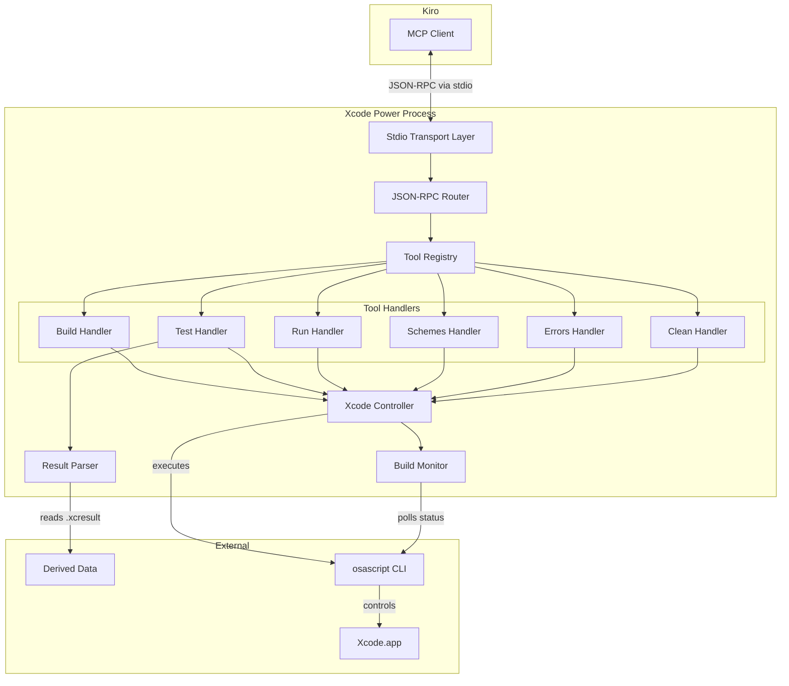

# Design Document: Xcode Power

## Overview

The Xcode Power is a Swift-based MCP (Model Context Protocol) server that exposes Xcode automation capabilities to Kiro. It communicates over JSON-RPC 2.0 via stdio, receiving tool call requests and dispatching them as JXA (JavaScript for Automation) scripts executed against Xcode.app through the `osascript` command.

The key design decision is to control Xcode directly rather than using `xcodebuild` CLI. This leverages Xcode's warm build cache and avoids cold-start compilation penalties, resulting in significantly faster incremental builds during iterative development.

### Key Design Decisions

1. **JXA over AppleScript**: JXA provides structured JSON output natively, making result parsing straightforward compared to AppleScript's text-based output.
2. **Polling over callbacks**: Xcode doesn't expose build completion events externally, so the server polls build status at 2-second intervals using lightweight JXA scripts.
3. **Swift with structured concurrency**: The server uses Swift's async/await and actors for safe concurrent handling of stdio I/O, process execution, and timeout management.
4. **Newline-delimited JSON-RPC**: Following the MCP stdio transport spec, messages are delimited by newlines without Content-Length headers (the server supports both modes for compatibility).

## Architecture



### Data Flow

1. Kiro launches the MCP server binary as a subprocess
2. The server reads newline-delimited JSON-RPC messages from stdin
3. The Router dispatches requests to the appropriate tool handler
4. Tool handlers invoke the Xcode Controller to execute JXA scripts
5. For builds/tests, the Build Monitor polls completion status at 2-second intervals
6. Results are serialized as JSON-RPC responses and written to stdout

## Components and Interfaces

### 1. StdioTransport

Handles low-level reading from stdin and writing to stdout.

```swift
actor StdioTransport {
    /// Reads the next complete JSON-RPC message from stdin.
    /// Messages are newline-delimited.
    func readMessage() async throws -> Data
    
    /// Writes a JSON-RPC response message to stdout followed by a newline.
    func writeMessage(_ data: Data) async throws
    
    /// Starts the read loop, yielding messages as an AsyncStream.
    func messages() -> AsyncStream<Data>
}
```

**Design rationale**: Using an actor ensures thread-safe access to stdin/stdout file handles. The AsyncStream interface allows the main run loop to process messages sequentially.

### 2. JSONRPCRouter

Parses JSON-RPC messages and routes them to handlers.

```swift
struct JSONRPCRouter {
    /// Registers a method handler for a given JSON-RPC method name.
    mutating func registerMethod(_ method: String, handler: @Sendable (JSONRPCRequest) async -> JSONRPCResponse)
    
    /// Routes an incoming message to the appropriate handler.
    /// Returns nil for notifications (no id field).
    func route(_ message: Data) async -> Data?
    
    /// Handles malformed messages with parse error (-32700).
    /// Handles unknown methods with method not found (-32601).
}
```

### 3. ToolRegistry

Manages tool definitions and dispatches `tools/call` requests.

```swift
struct ToolDefinition: Codable {
    let name: String
    let description: String
    let inputSchema: JSONSchema
}

actor ToolRegistry {
    /// Returns all registered tool definitions for tools/list responses.
    func listTools() -> [ToolDefinition]
    
    /// Dispatches a tool call to the appropriate handler.
    func callTool(name: String, arguments: [String: Any]) async throws -> ToolResult
}
```

### 4. XcodeController

Executes JXA scripts against Xcode and manages availability checks.

```swift
actor XcodeController {
    /// Checks if Xcode.app is currently running.
    func isXcodeRunning() async throws -> Bool
    
    /// Checks if a project or workspace is open in Xcode.
    func hasOpenProject() async throws -> Bool
    
    /// Executes a JXA script and returns the parsed stdout.
    /// Applies a timeout (default 30s for non-build operations).
    func executeJXA(_ script: String, timeout: Duration) async throws -> String
    
    /// Triggers a build for the given scheme (nil = active scheme).
    func build(scheme: String?) async throws -> BuildResult
    
    /// Triggers test execution for the given scheme and optional test identifier.
    func test(scheme: String?, testIdentifier: String?) async throws -> Void
    
    /// Triggers run action for the given scheme (nil = active scheme).
    func run(scheme: String?) async throws -> RunResult
    
    /// Lists all schemes in the active workspace/project.
    func listSchemes() async throws -> [SchemeInfo]
    
    /// Retrieves current build diagnostics.
    func getDiagnostics() async throws -> [Diagnostic]
    
    /// Cleans the build folder for the given scheme (nil = active scheme).
    func clean(scheme: String?) async throws
}
```

**Design rationale**: The actor isolation ensures that JXA script executions are serialized, preventing race conditions when multiple tool calls arrive in quick succession. Xcode's scripting bridge is not thread-safe.

### 5. BuildMonitor

Polls Xcode's build status until completion or timeout.

```swift
actor BuildMonitor {
    /// Polls build status at the configured interval until complete or timeout.
    /// - Parameters:
    ///   - pollInterval: Time between status checks (default 2 seconds)
    ///   - timeout: Maximum wait time (default 300 seconds for builds)
    /// - Returns: The final build status
    func awaitCompletion(
        pollInterval: Duration = .seconds(2),
        timeout: Duration = .seconds(300)
    ) async throws -> BuildStatus
    
    /// Executes a lightweight JXA script to check current build state.
    func checkStatus() async throws -> BuildStatus
}
```

### 6. ResultParser

Extracts structured test results from .xcresult bundles.

```swift
struct ResultParser {
    /// Locates the most recent .xcresult bundle in derived data.
    func findLatestXCResult(derivedDataPath: String) throws -> URL
    
    /// Parses test results from an .xcresult bundle using xcrun xcresulttool.
    func parseTestResults(bundlePath: URL) async throws -> TestResults
    
    /// Extracts individual test case results from the xcresulttool JSON output.
    func extractTestCases(from json: Data) throws -> [TestCaseResult]
}
```

### 7. ProcessExecutor (Internal Utility)

Wraps Foundation's `Process` for async execution with timeout support.

```swift
struct ProcessExecutor {
    /// Runs a command with arguments, capturing stdout and stderr.
    /// Throws on timeout or non-zero exit code.
    static func run(
        command: String,
        arguments: [String],
        timeout: Duration
    ) async throws -> ProcessOutput
}

struct ProcessOutput {
    let stdout: String
    let stderr: String
    let exitCode: Int32
}
```

## Data Models

### JSON-RPC Messages

```swift
struct JSONRPCRequest: Codable {
    let jsonrpc: String  // Always "2.0"
    let id: JSONRPCId?   // nil for notifications
    let method: String
    let params: AnyCodable?
}

enum JSONRPCId: Codable {
    case int(Int)
    case string(String)
}

struct JSONRPCResponse: Codable {
    let jsonrpc: String  // Always "2.0"
    let id: JSONRPCId
    let result: AnyCodable?
    let error: JSONRPCError?
}

struct JSONRPCError: Codable {
    let code: Int
    let message: String
    let data: AnyCodable?
}
```

### MCP Protocol Models

```swift
struct InitializeResult: Codable {
    let protocolVersion: String
    let capabilities: ServerCapabilities
    let serverInfo: ServerInfo
}

struct ServerCapabilities: Codable {
    let tools: ToolsCapability?
}

struct ToolsCapability: Codable {
    let listChanged: Bool?
}

struct ServerInfo: Codable {
    let name: String
    let version: String
}

struct ToolCallParams: Codable {
    let name: String
    let arguments: [String: AnyCodable]?
}

struct ToolResult: Codable {
    let content: [ToolContent]
    let isError: Bool?
}

struct ToolContent: Codable {
    let type: String  // "text"
    let text: String
}
```

### Build & Test Models

```swift
enum BuildStatus: String, Codable {
    case running
    case succeeded
    case failed
    case timedOut
}

struct BuildResult: Codable {
    let status: BuildStatus
    let duration: Double?  // seconds
    let errors: [Diagnostic]?
}

struct Diagnostic: Codable {
    let severity: DiagnosticSeverity
    let message: String
    let filePath: String?
    let lineNumber: Int?
}

enum DiagnosticSeverity: String, Codable {
    case error
    case warning
}

struct TestResults: Codable {
    let totalCount: Int
    let passedCount: Int
    let failedCount: Int
    let failures: [TestFailure]
}

struct TestFailure: Codable {
    let testName: String
    let failureMessage: String
    let filePath: String?
    let lineNumber: Int?
}

struct TestCaseResult: Codable {
    let name: String
    let className: String
    let status: TestCaseStatus
    let duration: Double
    let failureMessage: String?
    let filePath: String?
    let lineNumber: Int?
}

enum TestCaseStatus: String, Codable {
    case passed
    case failed
    case skipped
}

struct SchemeInfo: Codable {
    let name: String
}

struct RunResult: Codable {
    let status: String  // "launched"
    let errors: [Diagnostic]?
}
```

### Error Types

```swift
enum XcodePowerError: Error {
    case xcodeNotRunning
    case noProjectOpen
    case xcodeUnresponsive(timeout: Duration)
    case buildTimeout(maxDuration: Duration)
    case jxaExecutionFailed(stderr: String, exitCode: Int32)
    case xcresultNotFound(searchPath: String)
    case xcresultParsingFailed(reason: String)
    case invalidToolArguments(message: String)
}
```

### JSON-RPC Error Codes

| Code | Meaning | When Used |
|------|---------|-----------|
| -32700 | Parse error | Malformed JSON received |
| -32601 | Method not found | Unknown JSON-RPC method |
| -32602 | Invalid params | Missing/invalid tool arguments |
| -32603 | Internal error | Unexpected server failure |


## Correctness Properties

*A property is a characteristic or behavior that should hold true across all valid executions of a system—essentially, a formal statement about what the system should do. Properties serve as the bridge between human-readable specifications and machine-verifiable correctness guarantees.*

### Property 1: Malformed JSON produces parse error

*For any* byte sequence that is not valid JSON, when submitted to the JSON-RPC router, the response SHALL contain error code -32700 (Parse error) and a descriptive message.

**Validates: Requirements 1.4**

### Property 2: Unknown methods produce method-not-found error

*For any* syntactically valid JSON-RPC request whose method field is not in the set of registered methods, the response SHALL contain error code -32601 (Method not found).

**Validates: Requirements 1.5**

### Property 3: Scheme parameter propagation to JXA scripts

*For any* tool call that accepts a scheme parameter (xcode_build, xcode_test, xcode_run, xcode_clean) and *for any* valid scheme name string, the generated JXA script SHALL contain that scheme name as the target of the Xcode action.

**Validates: Requirements 3.1, 4.1, 5.2, 8.2**

### Property 4: Test identifier propagation to JXA scripts

*For any* xcode_test tool call with a test identifier parameter (class name, method name, or class/method combination), the generated JXA script SHALL target only the specified test.

**Validates: Requirements 4.2**

### Property 5: Build monitor terminates with correct status

*For any* sequence of poll responses consisting of zero or more "running" statuses followed by a terminal status ("succeeded" or "failed"), the build monitor SHALL return the terminal status. For any sequence that exceeds the timeout without a terminal status, the monitor SHALL return "timedOut".

**Validates: Requirements 3.3, 3.6**

### Property 6: Failed build response includes all diagnostics

*For any* non-empty set of build diagnostics (errors and warnings), the build failure response SHALL include every diagnostic with its severity, message, file path, and line number preserved.

**Validates: Requirements 3.5, 7.2**

### Property 7: xcresulttool JSON parsing round-trip

*For any* valid xcresulttool JSON output representing test results, parsing it into the TestResults model and then serializing back SHALL preserve the test count, pass/fail counts, and all failure details.

**Validates: Requirements 4.4**

### Property 8: Test result aggregation correctness

*For any* set of TestCaseResult objects, the aggregated TestResults SHALL have totalCount equal to the set size, passedCount equal to the number with status "passed", failedCount equal to the number with status "failed", and the failures array SHALL contain exactly the failed test cases with their names, messages, and locations.

**Validates: Requirements 4.5**

### Property 9: Scheme list completeness

*For any* list of scheme names returned by the Xcode query, the tools/call response for xcode_list_schemes SHALL contain an array of scheme objects with exactly those names, in any order, with no additions or omissions.

**Validates: Requirements 6.2, 6.3**

### Property 10: JSON-RPC response structure compliance

*For any* valid JSON-RPC request (with an id field), the response SHALL contain `"jsonrpc": "2.0"` and an `id` field whose value is identical to the request's id (whether integer or string).

**Validates: Requirements 9.1, 9.2**

### Property 11: Notifications produce no response

*For any* valid JSON-RPC message that lacks an `id` field (a notification), the server SHALL produce no output on stdout for that message.

**Validates: Requirements 9.3**

### Property 12: Non-zero JXA exit propagates error

*For any* JXA script execution that exits with a non-zero status code, the resulting error SHALL contain the stderr output from the process.

**Validates: Requirements 10.3**

## Error Handling

### Error Propagation Strategy

Errors are categorized into three layers, each with distinct handling:

**Layer 1: Transport Errors**
- Malformed JSON → JSON-RPC error -32700 (Parse error)
- Invalid JSON-RPC structure → JSON-RPC error -32600 (Invalid request)
- These are returned as JSON-RPC error responses and never crash the server

**Layer 2: Protocol Errors**
- Unknown method → JSON-RPC error -32601 (Method not found)
- Invalid tool arguments → JSON-RPC error -32602 (Invalid params)
- These indicate client misuse and are non-fatal

**Layer 3: Tool Execution Errors**
- Xcode not running → Tool result with `isError: true` and descriptive message
- No project open → Tool result with `isError: true` and descriptive message
- Build timeout → Tool result with `isError: true` and timeout details
- JXA execution failure → Tool result with `isError: true` and stderr content
- xcresult not found → Tool result with `isError: true` and search path info

### Error Response Format

Tool execution errors are returned as successful JSON-RPC responses (no `error` field) but with `isError: true` in the tool result, following MCP convention:

```json
{
  "jsonrpc": "2.0",
  "id": 1,
  "result": {
    "content": [
      {
        "type": "text",
        "text": "Error: Xcode is not running. Please open Xcode and a project before using this tool."
      }
    ],
    "isError": true
  }
}
```

### Timeout Strategy

| Operation | Timeout | Rationale |
|-----------|---------|-----------|
| JXA script (non-build) | 30 seconds | Simple queries shouldn't take long |
| Build monitoring | 300 seconds | Large projects may take several minutes |
| Test monitoring | 300 seconds | Test suites can be lengthy |
| Xcode responsiveness | 30 seconds | Detect hung Xcode early |

### Graceful Degradation

- If Xcode crashes mid-build, the next poll will detect the absence and return an error
- If the derived data path doesn't exist, the result parser returns a clear error rather than crashing
- If xcresulttool is not available (unlikely on a system with Xcode), the error message suggests checking the Xcode installation

## Testing Strategy

### Property-Based Testing

The server's pure logic layers are well-suited to property-based testing. We will use [SwiftCheck](https://github.com/typelift/SwiftCheck) as the property-based testing library for Swift.

**Configuration:**
- Minimum 100 iterations per property test
- Each property test tagged with: `Feature: xcode-power, Property {number}: {property_text}`

**Testable layers (pure logic, no I/O):**
- JSON-RPC message parsing and routing
- Response construction (id echoing, jsonrpc field)
- JXA script generation from tool parameters
- xcresulttool JSON parsing into TestResults model
- Test result aggregation (counting, filtering failures)
- Build monitor state machine logic
- Error classification and message formatting

### Unit Testing (Example-Based)

Unit tests cover specific scenarios and edge cases:

- Initialize handshake produces correct response structure
- State transition from uninitialized → ready
- Specific error messages for "Xcode not running" and "No project open"
- Timeout behavior with mocked slow processes
- tools/list response contains all 6 tools with schemas
- Content-Length header parsing
- Empty scheme list returns `[]`
- Empty diagnostics returns `[]`

### Integration Testing

Integration tests verify end-to-end behavior with real (or simulated) Xcode:

- Full stdio round-trip: write request to stdin, read response from stdout
- JXA script execution against a running Xcode instance
- .xcresult bundle discovery in a real derived data directory
- Build monitoring with actual Xcode build (requires Xcode + project)

### Test Organization

```
Tests/
├── XcodePowerTests/
│   ├── Properties/
│   │   ├── JSONRPCPropertyTests.swift      # Properties 1, 2, 10, 11
│   │   ├── JXAGenerationPropertyTests.swift # Properties 3, 4
│   │   ├── BuildMonitorPropertyTests.swift  # Property 5
│   │   ├── DiagnosticsPropertyTests.swift   # Property 6
│   │   ├── ResultParserPropertyTests.swift  # Properties 7, 8
│   │   ├── SchemeListPropertyTests.swift    # Property 9
│   │   └── ProcessErrorPropertyTests.swift  # Property 12
│   ├── Unit/
│   │   ├── InitializeTests.swift
│   │   ├── ToolRegistryTests.swift
│   │   ├── ErrorHandlingTests.swift
│   │   └── TimeoutTests.swift
│   └── Integration/
│       ├── StdioTransportTests.swift
│       └── XcodeControllerTests.swift
```

### Mocking Strategy

For property and unit tests, the following components are mocked:

- **ProcessExecutor**: Mocked to return configurable stdout/stderr/exit codes without spawning real processes
- **FileManager**: Mocked for xcresult bundle discovery tests
- **XcodeController**: Mocked at the protocol level for tool handler tests

```swift
protocol ProcessExecuting: Sendable {
    func run(command: String, arguments: [String], timeout: Duration) async throws -> ProcessOutput
}

protocol XcodeControlling: Sendable {
    func isXcodeRunning() async throws -> Bool
    func hasOpenProject() async throws -> Bool
    func executeJXA(_ script: String, timeout: Duration) async throws -> String
}
```

This protocol-based design enables dependency injection for testing while keeping the production implementation concrete and performant.
